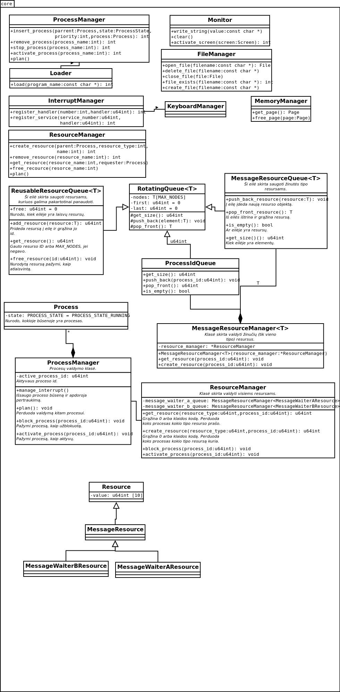

=========
Projektas
=========

x86-64 bitų architektūrai skirtos operacinės sistemos projektas.

Procesai
========

Visi procesai vykdo programas, kurios yra pakraunamos į operatyviąją
atmintį kartu su operacine sistema, prieš jai startuojant.
Gavus nurodymą yra padaroma programos kopija
naujai išskirtoje atmintyje (kiekvienai programai yra skiriama 16 MB
operatyviosios atminties), nustatomos reikiamos registrų reikšmės ir 
yra „šokama“ į programos vykdomojo kodo pradžią. Programos
vykdymo metu atsiradusius pertraukimus apdoroja procesas ``init``.
Galimi pertraukimai:

+ ``int 0x3f`` – kreipimasis į operacinės sistemos funkcijas, procesas
  pereina iš būsenos vykdomas į būseną pasiruošęs arba blokuotas;
+ ``int 0x20`` – laikrodžio pertraukimas, jam įvykus procesas pereina iš
  būsenos vykdomas į būseną pasiruošęs.

Sisteminiai procesai:

+   ``init`` – menamas procesas (jo nėra procesų lentelėje), kuriame veikia 
    operacinės sistemos branduolys;
+   ``loader`` – procesas, kuris rūpinasi resursų reikalingų naudotojo 
    proceso paleidimui, gavimu;
+   ``waitera`` ir ``waiterb`` – procesai, kurie užima procesorių 
    *laisvalaikiu*, keisdamiesi resursais;
+   ``sleep`` – procesas, kuris užima procesorių *laisvalaikiu* jį 
    sustabdydamas.

Tam, kad sistema nenulūžtų būtina, kad nuolat jos procesų lentelėje būtų
bent vienas aktyvus procesas. Tuo tikslu startuojant yra sukuriami procesai
``waitera`` ir ``waiterb``.

Be sisteminių procesų sistemoje taip pat gali būti vykdomos naudotojo 
programos.

Procesai ``waitera`` ir ``waiterb``
-----------------------------------

Šiuos abu procesus sukuria ``init`` operacinės sistemos startavimo metu. 
Taip pat juos sukurti gali nurodyti naudotojas.

``waitera`` veikimo algoritmas:

.. code-block:: python

  while True:
    create_resource(MessageWaiterA)
    get_resource(MessageWaiterB)

``waiterb`` veikimo algoritmas:

.. code-block:: python
  
  while True:
    get_resource(MessageWaiterA)
    create_resource(MessageWaiterB)

Procesas ``loader``
-------------------

Šį procesą sukuria ``init`` operacinės sistemos startavimo metu. Taip pat 
jį sukurti gali nurodyti naudotojas.

``loader`` veikimo algoritmas:

.. code-block:: python
  
  while True:
    get_resource(MessageLoadProgram)
    get_resource(Memory)
    create_process();

Procesas ``sleep``
------------------

Sukurti šį procesą gali nurodyti naudotojas.

``sleep`` veikimo algoritmas:

.. code-block:: python
  
  while True:
    hlt();                              # Sustabdo procesorių.

Naudotojo procesai
------------------

Naudotojo procesus sukuria ``init``, gavęs naudotojo nurodymą
(per klaviatūrą). Naudotojas taip pat gali nurodyti paleisti ir sisteminius
procesus. (Sistemoje gali veikti keli ``loader`` procesai ir t.t.)
Sistemos startavimo metu ``init`` sukurti procesai nuo naudotojo nurodymu
sukurtų procesų skiriasi tuo, kad ``init`` sukurtieji neturi prieigos prie
įvesties ir išvesties.

Resursų sąrašas
===============

Žinutės:

+   ``MessageWaiterAResource`` – proceso ``waitera`` kuriama žinutė, kurios
    laukia procesas ``waiterb``;
+   ``MessageWaiterBResource`` – proceso ``waiterb`` kuriama žinutė, kurios
    laukia procesas ``waitera``;
+   ``MessageLoadProgramResource`` – naudotojo nurodymas sukurti programą,
    kurio laukia procesas ``loader``;
+   ``Byte`` – naudotojo įvestas simbolis. Šio resurso gali prašyti bet
    kuris iš naudotojo procesų.

Perpanaudojami resursai:

+   ``MemoryResource`` – atminties resursas, kurio fiksuotą kiekį sukuria
    ``init`` sistemos startavimo metu ir kurio laukia procesas ``loader``;
+   ``File`` – failų sistemos failas. Šio resurso gali prašyti bet kuris
    iš naudotojo procesų.

Operacinės sistemos branduolys
==============================

Operacinės sistemos branduolio klasių diagrama:

  OS branduolio diagrama.

Operacinės sistemos sąsaja
==========================

Naudotojo programa
------------------

Naudotojo programa OS funkcijas gali pasiekti per 0x3f pertraukimą. Kokią
funkciją reikia iškviesti nurodo registro ``rax`` reikšmė:

+   ``0`` – naudotojo programa baigė darbą;
+   ``1`` – atidaryti failą, kurio pavadinimas yra ``rbx`` reikšmė, 
    skaitymui (atidaryto failo id būna registre ``rax``);
+   ``2`` – atidaryti failą, kurio pavadinimas yra ``rbx`` reikšmė,
    rašymui (atidaryto failo id būna registre ``rbx``);
+   ``3`` – uždaryti failą, kurio id yra nurodytas registre ``rbx``;
+   ``4`` – ištrinti failą, kurio pavadinimas yra registro ``rbx`` reikšmė;
+   ``5`` – nuskaityti baitą į ``al`` (``rax`` laisva vieta užpildoma 0) 
    iš atidaryto failo, kurio id yra nurodytas registre ``rbx``;
+   ``6`` – įrašyti baitą iš ``rdi`` (įrašo žemiausią baitą) į failą, kurio 
    id yra nurodytas registre ``rbx``;

Iškvietus OS funkciją su neteisingais parametrais arba sukėlus bet kurį kitą
pertraukimą, naudotojo programa yra išjungiama.

Servisas ``loader``
-------------------

Servisas ``loader`` be naudotojo programai pasiekiamų OS funkcijų dar gali 
prieiti prie tokių:

+   ``10`` – prašyti resurso ``LoadProgram`` (programos id grąžinamas,
    kaip ``rax``, ekrano id, kaip ``rbx``);
+   ``11`` – prašyti resurso ``Memory`` (resurso id grąžinamas, kaip
    ``rax`` reikšmė);
+   ``12`` – sukurti naują procesą (programos id perduodamas, kaip 
    ``rdi``, ekrano id – ``rsi``, o atminties resurso id – ``rdx``).

Servisas ``waitera``
--------------------

Servisas ``waitera`` gali pasiekti tokias OS funkcijas:

+   ``20`` – kurti resursą ``MessageWaiterAResource``;
+   ``21`` – prašyti resurso ``MessageWaiterBResource``.

Servisas ``waiterb``
--------------------

Servisas ``waiterb`` gali pasiekti tokias OS funkcijas:

+   ``30`` – kurti resursą ``MessageWaiterBResource``;
+   ``31`` – prašyti resurso ``MessageWaiterAResource``.

Išdėstymo atmintyje planas
==========================

Reali atmintis
--------------

Sistemos vaizdas realioje atmintyje.

+--------------------+-------+------------------------------------------+
| Adresas            | Dydis | Prasmė                                   |
+====================+=======+==========================================+
| 0x00000000001fa000 |  1 MB | Čia guli branduolio vykdomasis           |
+--------------------+       | kodas.                                   |
| 0x00000000002f9fff |       |                                          |
|                    |       |                                          |
+--------------------+-------+------------------------------------------+
| 0x00000000002fa000 |  1 MB | Branduolio dėklas. Pradinis              |
+--------------------+       | ``rsp =  0xffff800000200000``.           |
| 0x00000000003f9fff |       |                                          |
|                    |       |                                          |
+--------------------+-------+------------------------------------------+
| 0x00000000003fa000 | 14 MB | Rezervuota branduolio reikmėms.          |
+--------------------+       |                                          |
| 0x00000000011f9fff |       |                                          |
|                    |       |                                          |
+--------------------+-------+------------------------------------------+
| 0x00000000011fa000 |  1 MB | Branduolio puslapiavimo lentelė.         |
+--------------------+       |                                          |
| 0x00000000012f9fff |       |                                          |
|                    |       |                                          |
+--------------------+-------+------------------------------------------+
| 0x00000000012fa000 |  1 MB | Serviso ``loader`` puslapiavimo          |
+--------------------+       | lentelė.                                 |
| 0x00000000013f9fff |       |                                          |
|                    |       |                                          |
+--------------------+-------+------------------------------------------+
| 0x00000000013fa000 |  1 MB | Serviso ``waitera`` (arba ``waiter``)    |
+--------------------+       | puslapiavimo lentelė.                    |
| 0x00000000014f9fff |       |                                          |
|                    |       |                                          |
+--------------------+-------+------------------------------------------+
| 0x00000000014fa000 |  1 MB | Serviso ``waiterb``                      |
+--------------------+       | puslapiavimo lentelė.                    |
| 0x00000000015f9fff |       |                                          |
|                    |       |                                          |
+--------------------+-------+------------------------------------------+
| 0x00000000015fa000 |  1 MB | 1 Naudotojo programos                    |
+--------------------+       | puslapiavimo lentelė.                    |
| 0x00000000016f9fff |       |                                          |
|                    |       |                                          |
+--------------------+-------+------------------------------------------+
| 0x00000000016fa000 |  1 MB | 2 Naudotojo programos                    |
+--------------------+       | puslapiavimo lentelė.                    |
| 0x00000000017f9fff |       |                                          |
|                    |       |                                          |
+--------------------+-------+------------------------------------------+
| 0x00000000017fa000 |  1 MB | 3 Naudotojo programos                    |
+--------------------+       | puslapiavimo lentelė.                    |
| 0x00000000018f9fff |       |                                          |
|                    |       |                                          |
+--------------------+-------+------------------------------------------+
| 0x00000000018fa000 |  1 MB | 4 Naudotojo programos                    |
+--------------------+       | puslapiavimo lentelė.                    |
| 0x00000000019f9fff |       |                                          |
|                    |       |                                          |
+--------------------+-------+------------------------------------------+
| 0x00000000019fa000 |  6 MB | Nepanaudota.                             |
+--------------------+       |                                          |
| 0x0000000001ffffff |       |                                          |
|                    |       |                                          |
+--------------------+-------+------------------------------------------+
| 0x0000000002000000 | 16 MB | Serviso ``loader`` atmintis.             |
+--------------------+       |                                          |
| 0x0000000002ffffff |       |                                          |
|                    |       |                                          |
+--------------------+-------+------------------------------------------+
| 0x0000000003000000 | 16 MB | Serviso ``waitera`` (arba ``waiter``)    |
+--------------------+       | atmintis.                                |
| 0x0000000003ffffff |       |                                          |
|                    |       |                                          |
+--------------------+-------+------------------------------------------+
| 0x0000000004000000 | 16 MB | Serviso ``waiterb`` atmintis             |
+--------------------+       |                                          |
| 0x0000000004ffffff |       |                                          |
|                    |       |                                          |
+--------------------+-------+------------------------------------------+
| 0x0000000005000000 | 16 MB | 1 naudotojo programos atmintis.          |
+--------------------+       |                                          |
| 0x0000000005ffffff |       |                                          |
|                    |       |                                          |
+--------------------+-------+------------------------------------------+
| 0x0000000006000000 | 16 MB | 2 naudotojo programos atmintis.          |
+--------------------+       |                                          |
| 0x0000000006ffffff |       |                                          |
|                    |       |                                          |
+--------------------+-------+------------------------------------------+
| 0x0000000007000000 | 16 MB | 3 naudotojo programos atmintis.          |
+--------------------+       |                                          |
| 0x0000000007ffffff |       |                                          |
|                    |       |                                          |
+--------------------+-------+------------------------------------------+
| 0x0000000008000000 | 16 MB | 4 naudotojo programos atmintis.          |
+--------------------+       |                                          |
| 0x0000000008ffffff |       |                                          |
|                    |       |                                          |
+--------------------+-------+------------------------------------------+
| 0x0000000009000000 | 112   | Nepanaudota.                             |
+--------------------+  MB   |                                          |
| 0x000000000fffffff |       |                                          |
|                    |       |                                          |
+--------------------+-------+------------------------------------------+
| 0x0000000010000000 | 16 MB | 0 failas.                                |
+--------------------+       |                                          |
| 0x0000000010ffffff |       |                                          |
+--------------------+-------+------------------------------------------+
| 0x0000000011000000 | 16 MB | 1 failas.                                |
+--------------------+       |                                          |
| 0x0000000011ffffff |       |                                          |
+--------------------+-------+------------------------------------------+
| 0x0000000012000000 | 16 MB | 2 failas.                                |
+--------------------+       |                                          |
| 0x0000000012ffffff |       |                                          |
+--------------------+-------+------------------------------------------+
| 0x0000000013000000 | 16 MB | 3 failas.                                |
+--------------------+       |                                          |
| 0x0000000013ffffff |       |                                          |
+--------------------+-------+------------------------------------------+
| 0x0000000014000000 | 16 MB | 4 failas.                                |
+--------------------+       |                                          |
| 0x0000000014ffffff |       |                                          |
+--------------------+-------+------------------------------------------+
| 0x0000000015000000 | 16 MB | 5 failas.                                |
+--------------------+       |                                          |
| 0x0000000015ffffff |       |                                          |
+--------------------+-------+------------------------------------------+
| 0x0000000016000000 | 16 MB | 6 failas.                                |
+--------------------+       |                                          |
| 0x0000000016ffffff |       |                                          |
+--------------------+-------+------------------------------------------+
| 0x0000000017000000 | 16 MB | 7 failas.                                |
+--------------------+       |                                          |
| 0x0000000017ffffff |       |                                          |
+--------------------+-------+------------------------------------------+
| 0x0000000018000000 | 16 MB | 8 failas.                                |
+--------------------+       |                                          |
| 0x0000000018ffffff |       |                                          |
+--------------------+-------+------------------------------------------+
| 0x0000000019000000 | 16 MB | 9 failas.                                |
+--------------------+       |                                          |
| 0x0000000019ffffff |       |                                          |
+--------------------+-------+------------------------------------------+
| 0x000000001a000000 | 16 MB | 10 failas.                               |
+--------------------+       |                                          |
| 0x000000001affffff |       |                                          |
+--------------------+-------+------------------------------------------+
| 0x000000001b000000 | 16 MB | 11 failas.                               |
+--------------------+       |                                          |
| 0x000000001bffffff |       |                                          |
+--------------------+-------+------------------------------------------+
| 0x000000001c000000 | 16 MB | 12 failas.                               |
+--------------------+       |                                          |
| 0x000000001cffffff |       |                                          |
+--------------------+-------+------------------------------------------+
| 0x000000001d000000 | 16 MB | 13 failas.                               |
+--------------------+       |                                          |
| 0x000000001dffffff |       |                                          |
+--------------------+-------+------------------------------------------+
| 0x000000001e000000 | 16 MB | 14 failas.                               |
+--------------------+       |                                          |
| 0x000000001effffff |       |                                          |
+--------------------+-------+------------------------------------------+
| 0x000000001f000000 | 16 MB | 15 failas.                               |
+--------------------+       |                                          |
| 0x000000001fffffff |       |                                          |
+--------------------+-------+------------------------------------------+

Branduolio virtuali atmintis
----------------------------

Branduolio virtualios atminties pirmas gigabaitas nukreiptas į realios
atminties pirmą gigabaitą.

+--------------------+-------+------------------------------------------+
| Adresas            | Dydis | Prasmė                                   |
+====================+=======+==========================================+
| 0xffff800000000000 |  1 MB | Čia guli branduolio vykdomasis           |
+--------------------+       | kodas.                                   |
| 0xffff8000000fffff |       |                                          |
|                    |       |                                          |
+--------------------+-------+------------------------------------------+
| 0xffff800000100000 |  1 MB | Branduolio dėklas. Pradinis              |
+--------------------+       | ``rsp =  0xffff800000200000``.           |
| 0xffff8000001fffff |       |                                          |
|                    |       |                                          |
+--------------------+-------+------------------------------------------+
| 0xffff800000200000 | 14 MB | Rezervuota branduolio reikmėms.          |
+--------------------+       |                                          |
| 0xffff800000ffffff |       |                                          |
|                    |       |                                          |
+--------------------+-------+------------------------------------------+

Procesų virtuali atmintis
-------------------------

+--------------------+-------+------------------------------------------+
| Adresas            | Dydis | Prasmė                                   |
+====================+=======+==========================================+
| 0x0000000000200000 | 16 MB | Programos kodas.                         |
+--------------------+       |                                          |
| 0x0000000001200000 |       |                                          |
|                    |       |                                          |
+--------------------+-------+------------------------------------------+

Failų sistema
=============

Programos vienu metu gali dirbti daugiausiai su 16 failų. Failo vardas
– bet koks 64 bitų skaičius.
