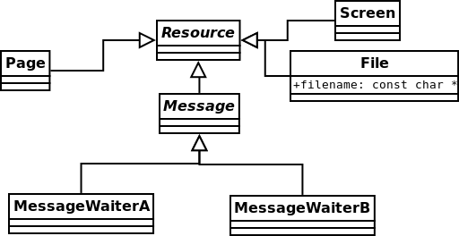

=========
Projektas
=========

Procesai
========

Sisteminiai procesai (veikia ``ring 0``):

+ ``init`` – menamas procesas, kuriame veikia operacinės sistemos 
  branduolys;
+ ``waitera`` ir ``waiterb`` – procesai, kurie užima procesorių 
  *laisvalaikiu*.

Taip pat sistemoje veikia naudotojo procesai, kurie veikia ``ring 3``.

Procesai ``waitera`` ir ``waiterb``
-----------------------------------

Šiuos abu procesus sukuria ``init`` operacinės sistemos startavimo metu.
Šie du procesai yra žemiausio prioriteto ir yra vykdomi tada, kai nėra
jokio kito pasiruošusio proceso.

``waitera`` veikimo algoritmas:

.. code-block:: python

  while True:
    create_resource(MessageWaiterA)
    get_resource(MessageWaiterB)

``waiterb`` veikimo algoritmas:

.. code-block:: python
  
  while True:
    get_resource(MessageWaiterA)
    create_resource(MessageWaiterB)

Naudotojo procesai
==================

Naudotojo procesai sistemoje atsiranda vienu iš dviejų būdų:

+ sukuria procesas ``init``, gavęs naudotojo nurodymą (per klaviatūrą);
+ naudotojo procesas sukuria dar vieną naudotojo procesą.

Naudotojo procesai vykdo programas, kurios yra įkompiliuotos į pačią
operacinę sistemą. Gavus nurodymą yra padaroma programos kopija, 
naujai išskirtoje atmintyje (kiekvienai programai yra skiriama 2 MB
operatyviosios atminties), procesorius yra perjungiamas į naudotojo
rėžimą ir yra „šokama“ į programos vykdomojo kodo pradžią. Programos
vykdymo metu atsiradusius pertraukimus apdoroja procesas ``init``.
Galimi pertraukimai:

+ ``int 0x80`` – kreipimasis į operacinės sistemos funkcijas, procesas
  pereina iš būsenos vykdomas į būseną pasiruošęs arba blokuotas;
+ ``int 0x20`` – laikrodžio pertraukimas, jam įvykus procesas pereina iš
  būsenos vykdomas į būseną pasiruošęs;
+ įvykus bet kuriam kitam pertraukimui, proceso vykdymas yra nutraukiamas.

Resursų sąrašas
===============

+ ``File`` kuria proceso ``init`` objektas ``FileManager``.
+ ``Screen`` (yra 4 tokio tipo resursai) kuria proceso ``init`` objektas
  ``Monitor``.
+ ``Page`` kuria proceso ``init`` objektas ``MemoryManager``.

  Resursų diagrama.

Operacinės sistemos branduolys
==============================

Operacinė sistemos kodas yra vykdomas proceso ``init`` aplinkoje.

.. figure:: core.png
  :scale: 100%
  :alt: OS branduolio diagrama.

  OS branduolio diagrama.
